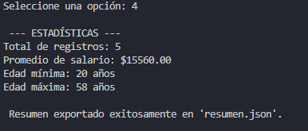
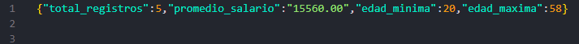

# 🚀 Sistema de Análisis y Gestión de Datos

Proyecto académico desarrollado para la asignatura de **Desarrollo de Aplicaciones para Dispositivos Móviles**.

---

## 🎯 Objetivo del Proyecto
Desarrollar una aplicación de consola funcional capaz de gestionar, procesar y analizar información de empleados desde archivos JSON externos, aplicando los principios fundamentales de la Programación Orientada a Objetos (POO) y asegurando la integridad de los datos mediante técnicas modernas de control.

## ⚠️ Problema que resuelve
El sistema soluciona la necesidad de procesar archivos de datos en formato JSON de manera segura y eficiente. Resuelve la fragilidad del manejo de datos al implementar controles de **Null Safety** y validaciones de entrada, evitando que el programa colapse ante registros incompletos, valores vacíos o entradas de usuario no esperadas.

## 🛠 Tecnologías Utilizadas
* **Lenguaje:** Dart
* **Gestión de archivos:** `dart:io` y `dart:convert`
* **Formato de datos:** JSON
* **Entorno:** Consola interactiva

## 🧠 Conceptos Aplicados
* **POO:** Modelado mediante clases, constructores `factory` y encapsulación.
* **Procesamiento de datos:** Filtrado dinámico utilizando métodos `.where()` y funciones anónimas.
* **Null Safety:** Manejo preventivo de errores con `??` y `double.tryParse`.
* **Análisis estadístico:** Algoritmos para cálculo de promedios, valores mínimos y máximos.
* **Persistencia:** Lectura de archivos locales y exportación a `resumen.json`.

---
## 📸 Capturas de Pantalla
### Menú principal


### Estadisticas


### Registro

---

## 🚀 Instrucciones de Ejecución
1. **Requisitos:** Asegúrate de tener instalado el SDK de Dart en tu entorno.
2. **Configuración:** Coloca el archivo `datos.json` en la misma carpeta que el archivo ejecutable.
3. **Terminal:** Abre una terminal en el directorio del proyecto.
4. **Ejecución:**
   ```bash
   dart run proyecto_final.dart

---
## Reflexión Personal
* ¿Qué aprendí?
Comprendí cómo transformar datos de texto plano (JSON) en objetos estructurados dentro de Dart, un proceso fundamental para el desarrollo móvil y web. Además, consolidé la importancia del Null Safety en aplicaciones profesionales.

* ¿Qué fue difícil?
El reto principal fue asegurar que el programa fuera robusto ante errores del usuario, especialmente al validar entradas numéricas y manejar la posibilidad de archivos inexistentes o mal estructurados.

* ¿Qué mejoraría?
Implementaría una interfaz gráfica (GUI) utilizando Flutter para mejorar la experiencia de usuario y añadiría manejo de errores más específico, como logs detallados en caso de fallo en la lectura de archivos.

#### Proyecto desarrollado por Josué Emmanuel Ojeda Ríos.