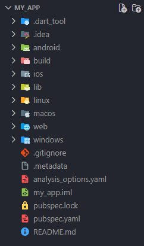
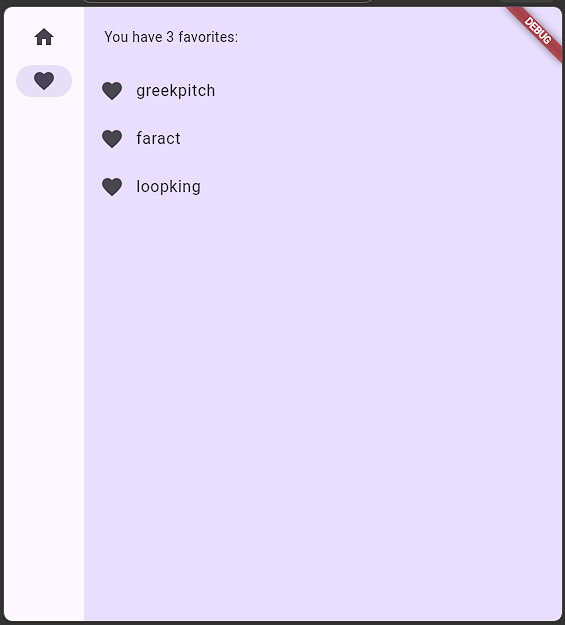

# 📱 Mi Primera App: Generador de Palabras (Namer App)

Proyecto académico desarrollado para la asignatura de **Desarrollo de Aplicaciones para Dispositivos Móviles**.

---

## 🎯 Objetivo del Proyecto
Crear una aplicación móvil funcional en Flutter que permita la generación de pares de palabras aleatorias, gestionando el estado de la aplicación mediante arquitecturas reactivas y adaptando la interfaz de forma responsiva a diferentes tamaños de pantalla.

## ⚠️ Problema que resuelve
El proyecto resuelve la necesidad de implementar una gestión de estado eficiente en aplicaciones móviles, permitiendo que la interfaz de usuario se actualice automáticamente ante cambios en los datos (como la adición de favoritos) sin necesidad de reconstrucciones manuales complejas.

## 🛠 Tecnologías Utilizadas
* **Framework:** Flutter (Material Design 3)
* **Lenguaje:** Dart
* **Gestión de Estado:** `provider`
* **Dependencias Externas:** `english_words` (suministro de datos léxicos)

## 🧠 Conceptos Aplicados
* **Arquitectura de Estado:** Implementación de `ChangeNotifierProvider` como nodo superior para la gestión centralizada de datos.
* **Diseño Responsivo:** Uso de `LayoutBuilder` y `NavigationRail` para ajustar la interfaz según el ancho de la ventana.
* **Composición de Widgets:** Abstracción estética mediante `BigCard` y estandarización de listas con `ListView`.
* **Accesibilidad:** Integración de `semanticsLabel` para compatibilidad con lectores de pantalla.

---

## 📸 Capturas de Pantalla
### Directorio


### Vista del sistema


### Favoritos



---
## 🚀 Instrucciones de Ejecución
1. **Requisitos:** Tener instalado el SDK de Flutter y el entorno de desarrollo (VS Code).
2. **Creación:** Utilizar el comando `Flutter: New Project` desde la paleta de comandos.
3. **Dependencias:** Asegurarse de incluir `english_words` y `provider` en el archivo `pubspec.yaml`.
4. **Ejecución:**
    ```bash
    flutter run

---
## Reflexión Personal
* ¿Qué aprendí? 
Logré profundizar en la arquitectura de software móvil, dominando la gestión de estados reactivos con ChangeNotifier y Provider para sincronizar la lógica de negocio con la interfaz de usuario.

* ¿Qué fue difícil?
El mayor reto fue la implementación de la responsividad mediante LayoutBuilder, logrando que la aplicación reaccione de forma inteligente a las distintas restricciones de pantalla[cite: 2].

* ¿Qué mejoraría?
Ampliaría la persistencia de datos para que los favoritos seleccionados se guarden en el almacenamiento local del dispositivo, manteniendo la información incluso después de cerrar la aplicación.

#### Proyecto desarrollado por Josué Emmanuel Ojeda Ríos.