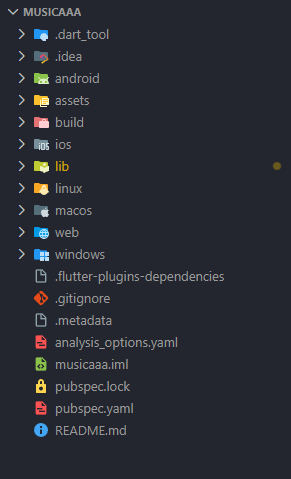
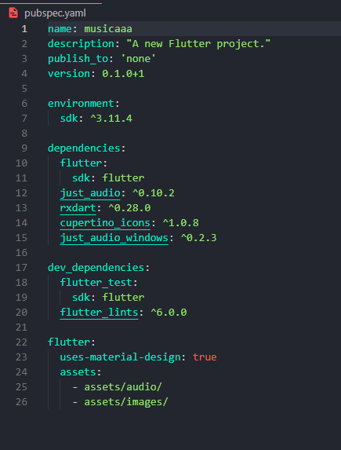
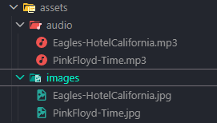

# 🎵 Mini Reproductor de Música (MusicPlayer)

Proyecto académico desarrollado para la asignatura de **Desarrollo de Aplicaciones para Dispositivos Móviles**.

---

## 🎯 Objetivo del Proyecto
Construir una aplicación de reproducción de audio robusta en Flutter, capaz de procesar archivos multimedia locales mediante motores de audio profesionales, gestionar estados reactivos y ofrecer una interfaz de usuario dinámica y responsiva.

## ⚠️ Problema que resuelve
El sistema resuelve la complejidad de integrar procesamiento de audio real en una aplicación móvil, superando las limitaciones de una simple simulación de interfaz. Gestiona eficientemente el flujo de datos asíncronos (*streams*), el *buffering* y la sincronización entre el estado de reproducción y los componentes visuales de la aplicación.

## 🛠 Tecnologías Utilizadas
* **Framework:** Flutter
* **Lenguaje:** Dart
* **Motor de Audio:** `just_audio`
* **Gestión de Flujos de Datos:** `rxdart`[cite: 3]
* **Entorno:** Consola y estructura de archivos nativa[cite: 3]

## 🧠 Conceptos Aplicados
* **Gestión de Estados Reactivos:** Implementación de `StreamBuilder` para actualizaciones automáticas de la UI basadas en el progreso del audio[cite: 3].
* **Automatización de Recursos:** Carga dinámica de archivos multimedia desde la carpeta `assets` mediante el sistema de archivos de Flutter, vinculando automáticamente audio e imágenes por nombre[cite: 3].
* **Control de Interfaz:** Creación de un `SeekBar` personalizado que traduce milisegundos a una barra de progreso interactiva[cite: 3].
* **Visualización Dinámica:** Implementación de un `RainbowVisualizer` para efectos visuales generativos[cite: 3].

---

## 📸 Capturas de Pantalla
### Directorio


### Archivo de configuraciones


### Directorio de musica e imagenes


### Vista del sistema con la musica detenida


### Vista del sistema con la musica reproduciendose


---
## 🚀 Instrucciones de Ejecución

1. **Requisitos:** Tener instalado el SDK de Flutter y las librerías `just_audio` y `rxdart` en `pubspec.yaml`[cite: 3].
2. **Assets:** Colocar los archivos `.mp3` en `assets/audio/` y sus carátulas `.jpg` en `assets/images/` con nombres coincidentes para la carga automática[cite: 3].
3. **Ejecución:**
    ```bash
    flutter run

---
## Reflexión Personal
* ¿Qué retos encontraste?
El mayor desafío fue la configuración del entorno y la gestión de archivos multimedia en Windows, además de asegurar que el motor de audio interpretara correctamente los datos para evitar errores de memoria.

* ¿Qué diferencia notaste entre simulación y reproducción real?
Una aplicación real debe manejar hilos de ejecución en segundo plano y comunicarse con APIs nativas para procesar eventos como el buffering y metadatos en tiempo real, a diferencia de una simulación que solo altera la interfaz.

* ¿Qué widgets son esenciales?
Considero indispensables el StreamBuilder para la reactividad, Image.asset para la identidad visual, el Slider para la interacción temporal y los IconButton para los controles básicos

#### Proyecto desarrollado por Josué Emmanuel Ojeda Ríos.