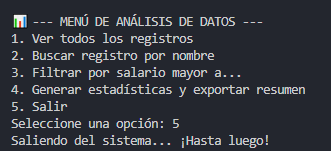
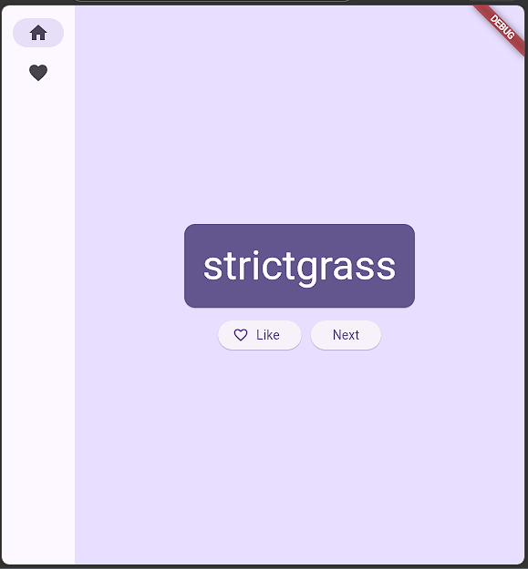

# 📂 Portafolio de Proyectos — Desarrollo de Aplicaciones para Dispositivos Móviles

Bienvenido al repositorio central de mi portafolio académico, donde documento la evolución y los proyectos desarrollados durante el semestre en la asignatura de **Desarrollo de Aplicaciones para Dispositivos Móviles**.

---

## 👤 Datos del Alumno
* **Nombre:** Josué Emmanuel Ojeda Ríos
* **Materia:** Desarrollo de Aplicaciones para Dispositivos Móviles
* **Docente:** Ing. Jesus Salas Marin
* **Semestre:** 8vo Semestre | Ing. Informática

---

## 📝 Descripción General
Este portafolio recopila las evidencias técnicas y aplicaciones desarrolladas durante el curso, demostrando la transición desde la lógica básica en consola hasta la creación de aplicaciones móviles funcionales. 

* **¿Qué contiene?:** El conjunto de proyectos prácticos (desde herramientas de gestión de datos hasta reproductores multimedia) que integran el ciclo de vida completo de una aplicación.
* **Tecnologías:** Enfocado principalmente en el ecosistema **Dart/Flutter**, implementando buenas prácticas de POO y gestión de estados.
* **Competencias desarrolladas:** Capacidad para estructurar aplicaciones móviles, manejo de dependencias, integración de recursos multimedia y resolución de problemas mediante algoritmos de procesamiento de datos en tiempo real.

---

## 🚀 Proyectos Incluidos

| Proyecto | Descripción | Vista Previa |
| :--- | :--- | :---: |
| **[Sistema de Análisis y Gestión de Datos (COBIKE)](./PROYECTO-FINAL)** | Aplicación de consola robusta para el procesamiento, filtrado y exportación de datos en formato JSON. |  |
| **[Mi Primera App](./PROYECTO-2_Mi_primera_aplicacion)** | Proyecto base en Flutter para la comprensión de estados reactivos y estructura de navegación. |  |
| **[Mini Reproductor de Música](./PROYECTO-3_Mini_reproductor_de_musica_flutter)** | Reproductor multimedia funcional con procesamiento de audio, carga automática de assets y visualización dinámica. |  |

---

## 🛠 Tecnologías Utilizadas

* **Lenguajes:** Dart
* **Frameworks:** Flutter (Material Design 3)
* **Arquitectura:** Provider, RxDart, Arquitectura reactiva
* **Herramientas de desarrollo:** VS Code, Git, GitHub
* **Gestión de librerías:** Pubspec.yaml
* **Otras herramientas:** Appsheet (integración y prototipado)

---

## 🔗 Enlaces de Interés
* [Mi Perfil en GitHub](https://github.com/oowl3)

---
*Desarrollado para el Instituto Tecnológico Superior de Lerdo.*